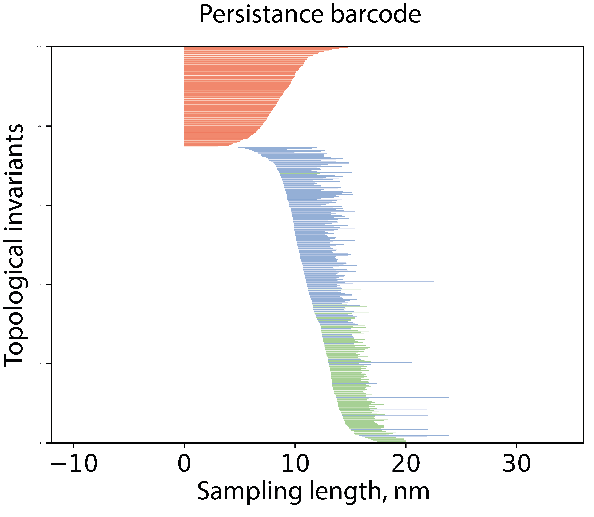

# Barcode project

## Code purpose

This code is used to calculate various dependencies from the surface topology obtained from an atomic force microscope.

## Dependencies
To run code need to install [git](https://git-scm.com/) and [conda](https://www.anaconda.com/) package manager.

## Installation

```bash
git clone https://github.com/ShockOfWave/barcode.git
cd barcode
conda env create -f environment.yml
conda activate barcode
```

## Usage
- To run code put the data in project directory.
```bash
python -m src
```
- Select folder with data in terminal
- Output data will be in folder output in directory with data

## Output example
### Graphs

<p align="center">
Barcode



</p>

<p align="center">
Persistence diagram


</p>

<p align="center">
Autocorrelation function


</p>

# License
## MIT

[](https://opensource.org/licenses/MIT)